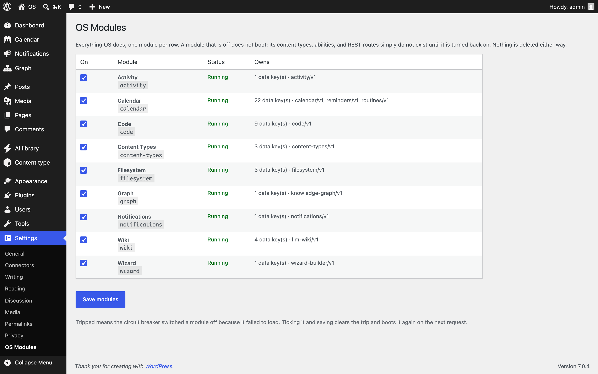
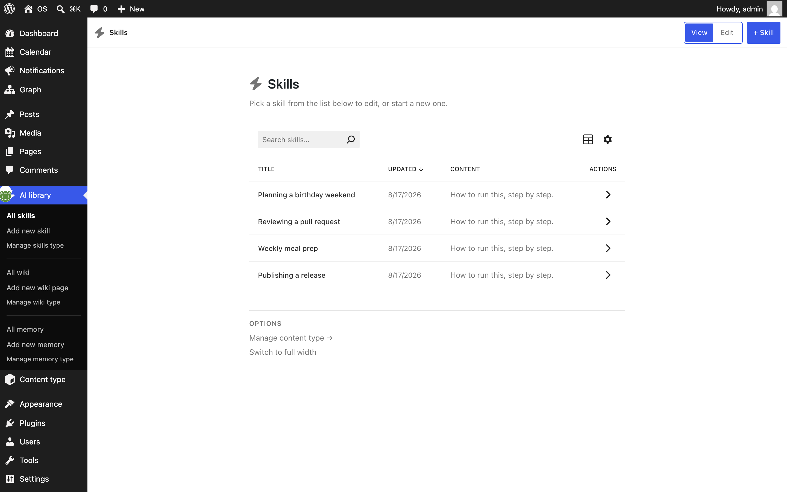
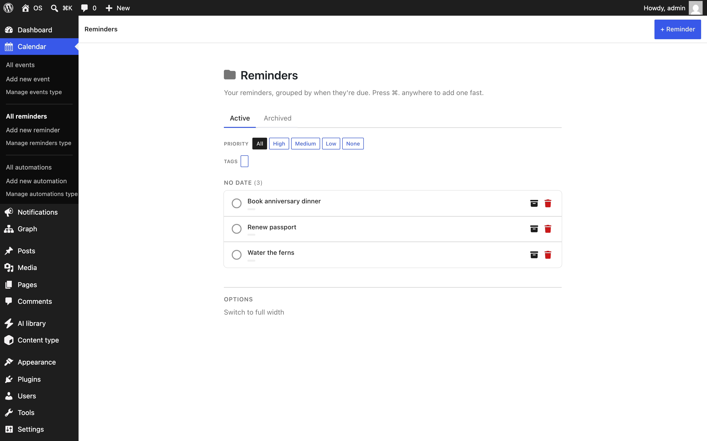

# OS

A personal operating system that lives in WordPress. Skills, wiki pages, memory, reminders, code snippets, and a knowledge graph, stored as content that both you and your agents can read and write.

One plugin, nine modules, one MCP endpoint. Turn off what you don't need.

## What's inside

| Module | What it does |
|---|---|
| Wiki | Skills, wiki pages, memory, and snippets. The knowledge store. |
| Calendar | Events, reminders, and scheduled automations. |
| Content Types | Define your own post types with schemas and field groups. |
| Code | PHP, JS, and CSS snippets with a fatal-error circuit breaker. |
| Filesystem | A jailed disk browser. |
| Graph | Entities and relationships across your content. |
| Activity | Everything that happened on the site, as a stream. |
| Notifications | One tray for alerts from every module. |
| Wizard | Multi-step guided flows. |

Each module ships its own admin app, built on WordPress components.

## Why one plugin instead of nine

The people who want this want the whole thing. One install beats nine installs in the right order, and one screen of switches beats guessing which four plugins to skip.

Modules stay independent inside the plugin. Each owns its data, its REST namespace, and its abilities, and reaches the others only through WordPress hooks. The boundaries are real; the plugin borders were overhead.

## Turning modules off

Every module is a switch under Settings → OS Modules. A module that's off doesn't boot: its content types, routes, and abilities don't exist until you turn it back on. Nothing is deleted either way.

On multisite the switches are per site, so two sites on one network can run different module sets from a single network activation.

## When a module breaks

A module that fails to load is switched off automatically, and the rest of the site carries on. The modules screen shows which one tripped and why. Tick it and save to boot it again once it's fixed.

Recovery never needs SSH. That's the point.

## For agents

Every module registers its tools through the [WordPress Abilities API](https://developer.wordpress.org/apis/abilities-api/), under its own namespace: `llm-wiki/*`, `calendar/*`, `code/*`, and so on. Install the [MCP Adapter](https://github.com/WordPress/mcp-adapter) and an agent sees the whole system on one endpoint.

REST routes mirror the same namespaces. Data identifiers live in one frozen namespace, `os_`, declared per module in `modules/*/module.json` and documented in [docs/contracts/DATA-INVENTORY.md](docs/contracts/DATA-INVENTORY.md).

## Install

1. Download `os.zip` from the [latest release](https://github.com/danielk-am/os-wp/releases/latest).
2. Go to Plugins → Add New Plugin → Upload Plugin.
3. Choose `os.zip` and click Install Now.
4. Click Activate.

Requirements:

- WordPress 6.9 or newer
- PHP 8.1 or newer
- [MCP Adapter](https://github.com/WordPress/mcp-adapter), optional, for agent access

Coming from the earlier Core Index or `os-*` plugin family? Run `wp ci migrate-options --execute` and then `wp ci migrate-types --execute --merge` to move your data onto the `os_` namespace. Compatibility shims keep old option names, queries, and REST routes answering either side of the move.

## Where this came from

OS started as a monolith, was split into nine standalone plugins in July 2026, and was merged back in August 2026 once it was clear the split was enforcing independence nobody used. The module boundaries the split proved are the ones this plugin keeps, as directories with manifests instead of separate plugins. The reasoning lives in [docs/contracts/MODULES.md](docs/contracts/MODULES.md).

## License

GPL-2.0-or-later. See [license.txt](license.txt).
